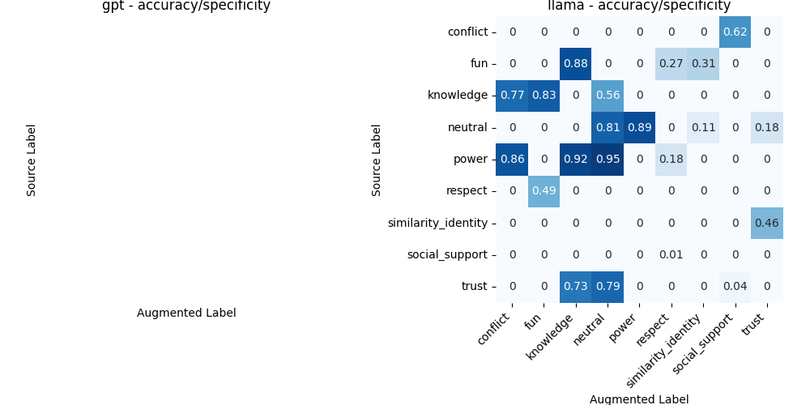

# LLM Self Evaluation

This folder contains the code to evaluate the LLM model on the self-evaluation task. The code is part of my (Viktor Due Pedersen) master level research project with Luca Maria Aiello, Anders Giovanni Møller and Arianna Pera as supervisors.

- [LLM Self Evaluation](#llm-self-evaluation)
  - [The task at hand](#the-task-at-hand)
    - [Description of the ten emotions](#description-of-the-ten-emotions)
  - [Evaluation subset](#evaluation-subset)

## The task at hand

Through out the rest of this repository you can find the code to create the datasets that is the foundation of this task. The datasets `data/ten-dim/balanced_{gpt-4,llama-70b}_augmented_full.json` contain curated data of pairs of texts. Each entry contain a:

- h_text: The *source* text belonging to the `target`.
- `target`: The emotion label of the `h_text`.
- augmented_h_text: A LLM received `h_text` and the given `target` as prompt and was asked to generate texts containing the same emotion.

### Description of the ten emotions

- *knowledge*: Exchange of ideas or information,
- *power*: Having power over the behavior and outcomes of another,
- *respect*: Conferring status, appreciation, gratitude, or admiration upon another,
- *trust*: Will of relying on the actions or judgments of another,
- *social_support*: Giving emotional or practical aid and companionship,
- *similarity_identity*: Shared interests, motivations, outlooks or Shared sense of belonging to the same community or group,
- *fun*: Experiencing leisure, laughter, and joy,
- *conflict*: Contrast or diverging views,
- *neutral*: neutral communication

## Evaluation subset

The counts of each `target` in `data/ten-dim/balanced_gpt-4_augmented_full.json` are as so:

| target              | Unique source texts | Total Augmented texts | Augmentations per source text |
| ------------------- | ------------------- | --------------------- | ----------------------------- |
| similarity_identity | 17                  | 550                   | 32,35                         |
| neutral             | 59                  | 590                   | 10                            |
| conflict            | 56                  | 560                   | 10                            |
| social_support      | 55                  | 550                   | 10                            |
| respect             | 30                  | 550                   | 18,33                         |
| knowledge           | 55                  | 550                   | 10                            |
| fun                 | 13                  | 550                   | 42,3                          |
| power               | 4                   | 550                   | 137,5                         |
| trust               | 13                  | 550                   | 42,3                          |

The counts of each `target` in `data/ten-dim/balanced_llama-70b_augmented_full.json` are as so:

| target              | Unique source texts | Total Augmented texts | Augmentations per source text |
| ------------------- | ------------------- | --------------------- | ----------------------------- |
| similarity_identity | 17                  | 495                   | 29,12                         |
| neutral             | 58                  | 522                   | 9                             |
| conflict            | 55                  | 495                   | 9                             |
| social_support      | 54                  | 486                   | 9                             |
| respect             | 30                  | 495                   | 16,5                          |
| knowledge           | 55                  | 495                   | 9                             |
| fun                 | 13                  | 495                   | 38,08                         |
| power               | 4                   | 495                   | 123,75                        |
| trust               | 13                  | 495                   | 38,08                         |

Clearly, some of the emotions are underrepresented, but have the same amount of augmented texts.

Since the ten emotions are so unevenly distributed, and due to time constraints, I have chosen to create a subset of the data. The subset is created by taking 250 random text pairs from each emotion and compares them to every other emotion. This results in 250 texts for each emotion against 2250 texts from the other emotions.

Generating the datasets are done with:

```bash
python src/worker_vs_gpt/evaluation/generate_datasets.py --N 250
```

Running llama self evaluation on the datasets are done with:

```bash
python src/worker_vs_gpt/evaluation/llama_self_evaluation.py
```

Evaluating and combining the results is done by running:

```bash
python src/worker_vs_gpt/evaluation/evaluate_performance.py
```

The following confusion matrix shows the scores of each emotion against each other emotion. The scores are sensitivity and accuracy.


